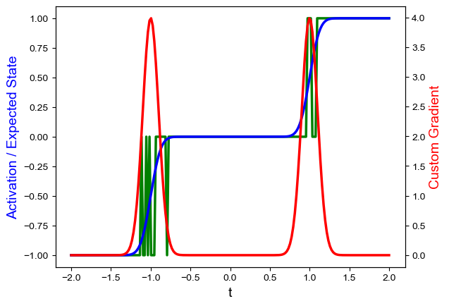
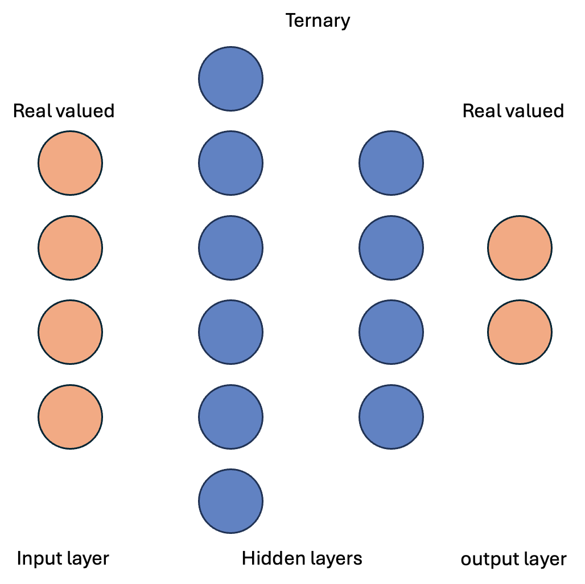
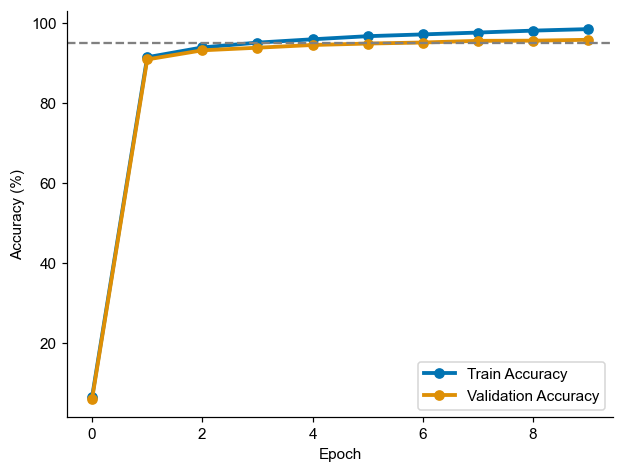

# TriDeNT (Tri-state Stochastic Deep Neural Network)

## Overview
Deep neural networks with discrete activations may be useful for efficient implementation. To that extent, binary and ternary neural networks have been shown to perform well on benchmarking tasks like MNIST [insert some refs]. However, it seems that the optimization techniques either use local learning rules or utilize approximations of gradients in a backpropagation like setting [(Mostafa et al. 2017, Front. Neurosci.)](https://www.frontiersin.org/journals/neuroscience/articles/10.3389/fnins.2017.00496/full). With added noise in the inputs, it might be possible to potentially leverage stochastic resonance to compute gradients. This would be useful for backpropagation and end-to-end training of neural networks with discrete states. In this analysis, we focus on ternary neural networks in which the activations $y \in \{-1, 0, 1\}$

## Structure of the workflow
### Theory of ternary neurons with stochastic inputs and gradient-based learning rule. This is being referred to by __TriDeNT__.
In this iteration, the neurons will have ternary activations. The weights and gradients are designed to be full precision. This network will be used for initial benchmarking on MNIST (and maybe a few more datasets...)

### Discretizing gradients
In this iteration, we would discretize the gradients. The idea is similar to the forward pass where full precision gradients will potnetially serve as a stochastic intensity for the gradient value to sample. Gradients will be either ternary or binary.

### Discretizing weights and gradients
In the final iteration, we can experiment with having discrete weights or at least low precision weights to be trained using discrete gradients.

## Theory for TriDeNT with full precision weights and gradients

Consider a ternary neuron with the ternary activation function.
Let thresholds be: $\theta = \{\theta_-, \theta_+\}$ 
$$
h(y) = \begin{cases}

-1 & \text{if } y \leq \theta_- \\
0  & \text{if } \theta_- < y < \theta_+ \\
+1  & \text{if } y \geq \theta_+ \\
\end{cases}
$$

Consider the noise-free inputs
$$\tilde{y} = \mathbf{W} x + b$$

Let $\xi \sim \mathcal{N}(0, \sigma)$ be the additive noise to this input. We thus define
$$y = \tilde{y} + \xi$$

Note that to determine the sate of a neuron in the network, the __noisy__ version of the input is used as argument to the $h(y)$ function. 

This allows us to define a probability distribution of neuron's state, marginal on the __noise-free__ inputs arriving to it. Let $P(S = s_i | \tilde{y})$ be this probability density function.
Here we assume $S \in \{s_1, s_2, \dots, s_k\}$ to be $k$ possible states. For ternary neurons $S \in \{-1, 0, 1\}$.
Let $\theta \in \{\theta_0, \theta_1, \dots, \theta_k\}$ be the thresholds. Note that $\theta_0$ and $\theta_k$ are assumed to be $\mp \infty$ respectively.

Given a known noise distribution $\xi$ (which we are assuming to be gaussian for now),

$$\begin{align}
P(S = s_i | \tilde{y}) &= P(y \in \{\theta_{i - 1}, \theta_i\}) \\

&= \int_{\theta_{i-1}}^{\theta_i} P(y | \tilde{y}) dt

\end{align}
$$

Let $F(t)$ be the CDF of $P(S | \tilde{y})$, then

$$\int_{\theta_{i-1}}^{\theta_i} P(y | \tilde{y}) dy = F(\theta_i) - F(\theta_{i-1})$$

We can subsequently define expected state conditional on noise-free inputs as

$$\mathbf{E}[(S | \tilde{y})] = \sum_{i = 1}^k s_i (F(\theta_i) - F(\theta_{i-1})$$

For gradient-based optimization, we can take the derivative of the expected with changes in the input as

$$\frac{d}{d\tilde{y}} \mathbf{E}(S | \tilde{y}) = \frac{d}{d\tilde{y}} \sum_{i = 1}^k s_i \int_{\theta_{i-1}}^{\theta_i} P(y | \tilde{y}) dy$$

Which in general case simplifies to
$$\frac{d}{d\tilde{y}} \mathbf{E}(S | \tilde{y}) =  \sum_{i = 1}^k s_i \Big( P(y = \theta_i | \tilde{y}) - P(y = \theta_{i - 1} | \tilde{y})\Big)$$

### Deriving closed-form expression for ternary case with gaussian noise
Writing out the probabilities.

$$
\begin{equation}
P(S = -1 | \tilde{y}) = \int_{-\infty}^{\theta_-} \frac{1}{\sqrt{2\pi} \sigma} e^{-\frac{(u - \tilde{y})^2}{2\sigma^2}} du
\end{equation}
$$

$$
\begin{equation}
P(S = 1 | \tilde{y}) = \int_{\theta_+}^{\infty} \frac{1}{\sqrt{2\pi} \sigma} e^{-\frac{(v - \tilde{y})^2}{2\sigma^2}} dv
\end{equation}
$$

Note that $\tilde{y}$ can be either interpreted as the mean of the gaussian or the offset that you need to subtract from the input to a standard gaussian $\mathcal{N}(\mu = 0, \sigma)$.

Applying the above equations to find the expected state, we get:

$$
\begin{equation*}
\mathbf{E}(S | \tilde{y}) = (-1) \cdot \int_{-\infty}^{\theta_-} \frac{1}{\sqrt{2\pi} \sigma} e^{-\frac{(u - \tilde{y})^2}{2\sigma^2}} du + (0).P(S = 0 | \tilde{y}) + (1) \cdot \int_{\theta_+}^{\infty} \frac{1}{\sqrt{2\pi} \sigma} e^{-\frac{(v - \tilde{y})^2}{2\sigma^2}} dv
\end{equation*}
$$

Note that $P(S = 0 | \tilde{y})$ can be written out as an integral, but it vanishes in expected value as it is multiplied by the state $S = 0$.

Simplifying, we get the following:

$$
\begin{equation}
\mathbf{E}(S | \tilde{y}) = \int_{\theta_+}^{\infty} \frac{1}{\sqrt{2\pi} \sigma} e^{-\frac{(v - \tilde{y})^2}{2\sigma^2}} dv - \int_{-\infty}^{\theta_-} \frac{1}{\sqrt{2\pi} \sigma} e^{-\frac{(u - \tilde{y})^2}{2\sigma^2}} du 
\end{equation}
$$

Although during simulations we never really need to compute the expected state, it is essentially difference between two $\text{erf}(.)$ functions. 

### Computing gradient of expected state
In the backward-pass, we need to tell the network which gradient to use in place of the problematic gradient of the thresholding function $h(y)$. To achieve this, we will pass the gradient of the expected state in the backward pass. Note that as there is addition of noise to the input, this gradient is surprisingly the exact gradient of the expected state of the neuron given noise-free input.

$$
\begin{align*}
\frac{d}{d\tilde{y}} \mathbf{E(S | \tilde{y})} &= \frac{d}{d\tilde{y}} \int_{\theta_+}^{\infty} \frac{1}{\sqrt{2\pi} \sigma} e^{-\frac{(v - \tilde{y})^2}{2\sigma^2}} dv - \frac{d}{d\tilde{y}} \int_{-\infty}^{\theta_-} \frac{1}{\sqrt{2\pi} \sigma} e^{-\frac{(u - \tilde{y})^2}{2\sigma^2}} du \\

&= \int_{\theta_+}^{\infty} \frac{\partial}{\partial \tilde{y}} \frac{1}{\sqrt{2\pi} \sigma} e^{-\frac{(v - \tilde{y})^2}{2\sigma^2}} dv - \int_{-\infty}^{\theta_-}  \frac{\partial}{\partial \tilde{y}} \frac{1}{\sqrt{2\pi} \sigma} e^{-\frac{(u - \tilde{y})^2}{2\sigma^2}} du \quad \text{(Leibnitz Rule)}
\end{align*}
$$

For further simplification we first differentiate the integrand w.r.t. $\tilde{y}$ and then apply fundamental theorem of calculus. We'll end up with this equation

$$
\begin{equation}
\frac{d}{d\tilde{y}} \mathbf{E(S | \tilde{y})} = \frac{1}{\sqrt{2\pi} \sigma} \Big( e^{- \frac{(\theta_- - \tilde{y})^2}{2\sigma^2}} + e^{- \frac{(\theta_+ - \tilde{y})^2}{2\sigma^2}}  \Big)
\end{equation}
$$

Which is simply
$$
\begin{equation}
\frac{d}{d\tilde{y}} \mathbf{E(S | \tilde{y})} = \mathcal{N}(\theta_-; \mu = \tilde{y}, \sigma) + \mathcal{N}(\theta_+; \mu = \tilde{y}, \sigma)
\end{equation}
$$

We'll use eq (7) to find gradients in the backward pass.

#### Visualizing the forward and backward passes

## Preliminary results
The results outlined below are preliminary! 

#### Current model setup

#### MNIST
Architecture: Fully connected feedforward network. Layer size: [784, 2000, 10]

 Test-set accuracy = 96.22% (pending bootstrap analysis to determine the error bars, but I was able to consistently get similar figures!)

